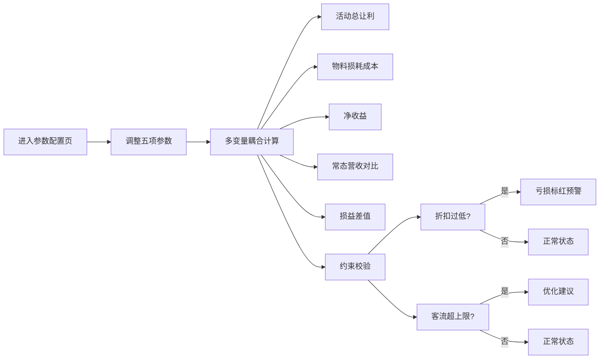

## 1. 产品概述

促销损益测算系统是一款面向门店运营人员的多变量联动测算工具，通过输入折扣力度、预估客流、单品均价、活动物料固定成本、库存损耗率五项核心参数，实时计算活动总让利、物料损耗成本、净收益，并与无活动常态营收对比生成损益差值，辅助运营决策。

- 目标用户：门店运营人员、促销策划人员
- 核心价值：通过多变量耦合计算，快速评估促销活动的经济效益，规避亏损风险

## 2. 核心功能

### 2.1 用户角色

| 角色 | 注册方式 | 核心权限 |
|------|----------|----------|
| 运营人员 | 无需登录 | 填写参数、查看测算结果、获取约束预警 |

### 2.2 功能模块

1. **参数配置面板**：五项联动参数输入（折扣力度、预估客流、单品均价、活动物料固定成本、库存损耗率）
2. **实时测算面板**：活动总让利、物料损耗成本、净收益三项核心指标联动计算
3. **常态对比面板**：无活动常态营收对比，损益差值计算
4. **约束校验面板**：折扣过低亏损预警（标红）、客流超上限优化建议

### 2.3 页面详情

| 页面名称 | 模块名称 | 功能描述 |
|----------|----------|----------|
| 参数配置页（3874） | 参数输入区 | 五项参数滑块+输入框联动，支持实时调整 |
| 参数配置页（3874） | 测算结果区 | 活动总让利、物料损耗成本、净收益实时联动计算 |
| 参数配置页（3874） | 常态对比区 | 无活动营收、活动营收、损益差值对比展示 |
| 参数配置页（3874） | 约束预警区 | 亏损标红预警、客流超上限优化建议 |

## 3. 核心流程

用户进入参数配置页面 → 填写/调整五项联动参数 → 系统实时计算所有关联指标 → 约束校验自动触发预警 → 用户对比损益差值做出决策

## 4. 用户界面设计

### 4.1 设计风格
- 主色调：深邃藏青 #1a2744 作为主背景，搭配琥珀金 #d4a853 作为数据高亮
- 辅助色：警示红 #e74c3c 用于亏损预警，成功绿 #27ae60 用于盈利状态
- 按钮风格：微立体圆角按钮，悬浮有光泽渐变效果
- 字体：数字使用等宽字体 JetBrains Mono，正文使用思源黑体
- 布局风格：卡片式三栏布局，左参数、中结果、右预警
- 图标风格：线性简洁图标，数据卡片带微动效

### 4.2 页面设计概述

| 页面名称 | 模块名称 | UI元素 |
|----------|----------|--------|
| 参数配置页 | 参数输入区 | 滑块组件、数字输入框、参数标签、单位提示 |
| 参数配置页 | 测算结果区 | 大号数字展示、趋势箭头、数据卡片悬浮动效 |
| 参数配置页 | 常态对比区 | 双栏对比布局、差值高亮、进度条可视化 |
| 参数配置页 | 约束预警区 | 预警卡片、标红闪烁效果、建议清单 |

### 4.3 响应式
- 桌面端优先设计（1440px+）
- 平板端自适应两栏布局
- 移动端单栏堆叠布局，触控优化

### 4.4 动效设计
- 参数调整时数字平滑过渡动画
- 预警触发时呼吸灯效果
- 卡片入场错落动画
- 数值变化时数字滚动效果
