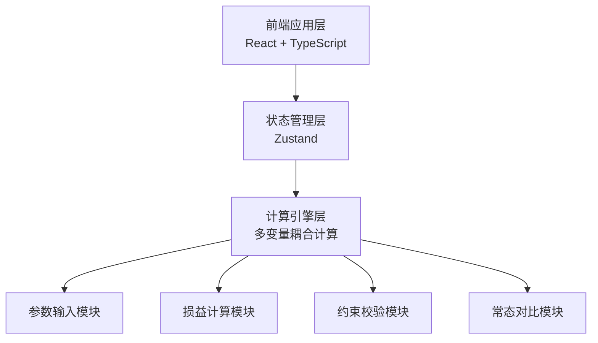

## 1. 架构设计



## 2. 技术描述

- 前端：React@18 + TypeScript + Vite
- 状态管理：zustand
- 样式：tailwindcss@3
- 部署端口：8875
- 后端：无（纯前端计算应用）

## 3. 路由定义

| 路由 | 用途 |
|------|------|
| /3874 | 参数配置页（主页面，承载全部测算操作） |
| / | 重定向到 /3874 |

## 4. 数据模型

### 4.1 输入参数

```typescript
interface CalculationParams {
  discountRate: number;      // 折扣力度 (0-100%)
  estimatedTraffic: number;  // 预估客流 (人)
  avgItemPrice: number;      // 单品均价 (元)
  fixedMaterialCost: number; // 活动物料固定成本 (元)
  inventoryLossRate: number; // 库存损耗率 (0-100%)
}
```

### 4.2 测算结果

```typescript
interface CalculationResult {
  totalConcession: number;      // 活动总让利 (元)
  materialLossCost: number;     // 物料损耗成本 (元)
  netRevenue: number;           // 净收益 (元)
  normalRevenue: number;        // 无活动常态营收 (元)
  activityRevenue: number;      // 活动营收 (元)
  profitLossDiff: number;       // 损益差值 (元)
  profitLossRate: number;       // 损益变化率 (%)
}
```

### 4.3 约束校验结果

```typescript
interface ConstraintResult {
  isLossWarning: boolean;       // 是否亏损预警
  lossWarningMsg: string;       // 亏损预警信息
  isTrafficOverflow: boolean;   // 是否客流超上限
  trafficSuggestion: string;    // 客流优化建议
  maxStoreCapacity: number;     // 门店接待上限
}
```

### 4.4 常态配置

```typescript
interface NormalConfig {
  normalTraffic: number;        // 常态客流
  normalDiscountRate: number;   // 常态折扣 (通常为0)
  normalMaterialCost: number;   // 常态物料成本
  normalLossRate: number;       // 常态损耗率
}
```

## 5. 核心计算逻辑

### 5.1 活动营收计算
```
活动营收 = 预估客流 × 单品均价 × (1 - 折扣力度) - 活动物料固定成本 - 库存损耗成本
库存损耗成本 = 预估客流 × 单品均价 × 库存损耗率
活动总让利 = 预估客流 × 单品均价 × 折扣力度
```

### 5.2 常态营收计算
```
常态营收 = 常态客流 × 单品均价 - 常态物料成本 - 常态损耗成本
```

### 5.3 损益差值
```
损益差值 = 活动净收益 - 常态净收益
损益变化率 = 损益差值 / 常态净收益 × 100%
```

### 5.4 约束校验
1. 亏损预警：活动净收益 < 0 → 标红预警
2. 客流超上限：预估客流 > 门店接待上限 → 优化建议
